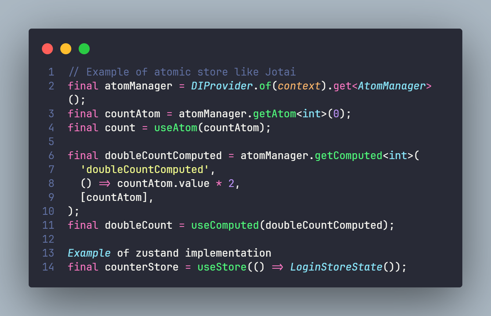
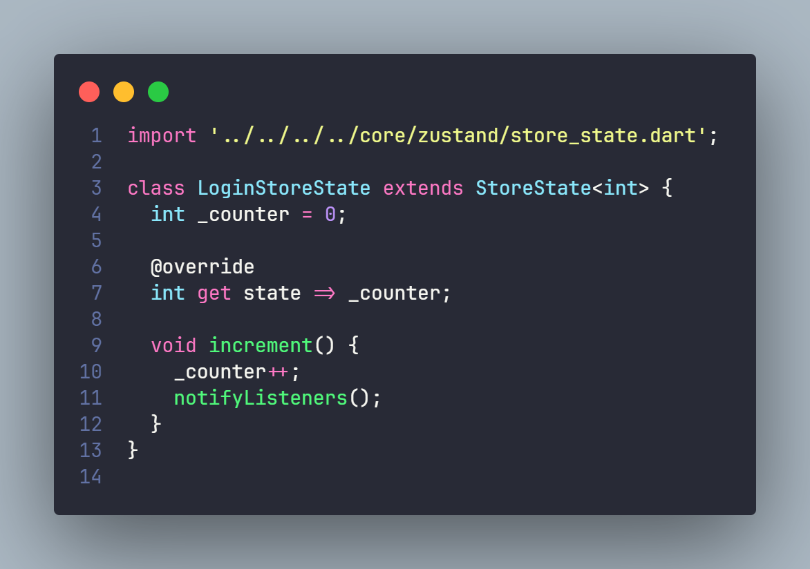

# README do Projeto

## Visão Geral

Este projeto é uma aplicação Flutter projetada para testar uma implementação própria de injeção de dependência e a integração das bibliotecas Jotai e Zustand do React em um ambiente Flutter. Ele está estruturado para separar a funcionalidade central dos módulos de recursos, garantindo uma arquitetura limpa e facilidade de manutenção. (códigos dentro do login_page.dart)

## Estrutura do Projeto

### Diretório `/app`

#### Funcionalidades Centrais

- `/core`: Contém os blocos de construção essenciais do aplicativo.
  - `/atoms`: Unidades fundamentais para gerenciamento de estado.
  - `/constants`: Constantes globais usadas em todo o aplicativo.
  - `/database`: Configurações e utilidades do banco de dados.
  - `/entities`: Modelos de dados e objetos de negócios.
  - `/errors`: Classes de erro personalizadas para a aplicação.
  - `/failures`: Casos de falha para tratamento de erros na lógica de negócios.
  - `/hooks`: Hooks personalizados do Flutter.
  - `/injection`: Configuração e configurações de injeção de dependência.
  - `/router`: Lógica de roteamento e navegação.
  - `/shared`: Recursos e utilidades compartilhadas.
    - `/theme`: Configurações de tema e estilo.
    - `/widgets`: Widgets reutilizáveis.
      - `/base_components`: Blocos de construção básicos para widgets.
      - `/common_widgets`: Widgets comumente usados em todo o aplicativo.
  - `/state`: Configurações de gerenciamento de estado.
  - `/usecase`: Lógica de negócios e casos de uso.
  - `/utils`: Funções utilitárias e ajudantes.
  - `/zustand`: Implementações de gerenciamento de estado do Zustand.

#### Módulos de Recursos

- `/features`: Recursos individuais do aplicativo, cada um em seu próprio diretório.
  - `/create_task/presentation`: UI e lógica para criação de tarefas.
  - `/home/presentation`: Componentes e widgets da tela inicial.
    - `/mocks`: Dados fictícios para testes.
    - `/widgets`: Widgets específicos para o recurso inicial.
  - `/login`: Funcionalidade de login do usuário.
    - `/data`: Manipulação de dados para login (chamadas de API, transformação de dados).
      - `/datasource`: Fontes de dados para dados de login.
      - `/repository`: Repositórios de dados para login.
    - `/domain`: Lógica de negócios para login.
      - `/datasource`: Definições abstratas de fontes de dados.
      - `/params`: Classes de parâmetros para casos de uso.
      - `/repository`: Definições abstratas de repositório.
      - `/usecases`: Casos de uso para funcionalidade de login.
    - `/presentation`: UI e gerenciamento de estado para login.
      - `/store`: Armazenamentos Zustand para estado de login.
      - `/widgets`: Componentes de UI específicos para login.
  - `/splash`: Implementação da tela de abertura.
    - `/data`: Camada de dados para a tela de abertura.
    - `/domain`: Lógica de negócios para a tela de abertura.
    - `/presentation`: Componentes de UI para a tela de abertura.

## Configuração e Instalação

Este guia passo a passo ajudará você a configurar e instalar o projeto Flutter em seu ambiente de desenvolvimento.

### Pré-requisitos

Antes de começar, certifique-se de ter o seguinte instalado em seu sistema:

- Flutter SDK
- Android Studio ou outro IDE de sua preferência
- Git (para clonagem do repositório)

### Passo 1: Instalar o Flutter SDK

1. Baixe o Flutter SDK do [site oficial do Flutter](https://flutter.dev/docs/get-started/install).
2. Extraia o arquivo em um diretório desejado (ex: `C:\src\flutter`).
3. Adicione o Flutter ao PATH do seu sistema operacional.

### Passo 2: Configurar o Ambiente de Desenvolvimento

1. Instale o Android Studio ou sua IDE preferida.
2. No Android Studio, instale o plugin do Flutter e do Dart através do 'Plugin Marketplace'.
3. Configure um emulador ou conecte um dispositivo físico para testar a aplicação.

### Passo 3: Clonar o Repositório do Projeto

1. Abra o terminal ou prompt de comando.
2. Navegue até o diretório onde deseja clonar o projeto.
3. Execute o comando: `git clone [URL do repositório]`.

### Passo 4: Abrir e Executar o Projeto

1. Abra o projeto clonado na sua IDE.
2. Baixe todas as dependências executando `flutter pub get` no terminal da IDE.
3. Inicie o emulador ou conecte o dispositivo.
4. Execute o projeto com `flutter run`.

### Passo 5: Verificar se Tudo está Funcionando

1. Depois de executar o projeto, você deve ver o aplicativo sendo executado no emulador ou dispositivo.
2. Navegue pelo aplicativo para garantir que tudo esteja funcionando conforme esperado.

### Problemas Comuns e Soluções

- Se você encontrar algum problema relacionado às dependências, tente executar `flutter pub upgrade`.
- Para problemas relacionados ao emulador, verifique se o emulador está configurado corretamente no Android Studio.

Se você encontrar outros problemas, consulte a [documentação oficial do Flutter](https://flutter.dev/docs) para orientações e soluções mais específicas.

---

Siga estes passos para configurar e instalar o projeto Flutter em seu ambiente. Para informações mais detalhadas, consulte a documentação oficial do Flutter.

## Implementação Jotai e Zustand

Esta imagem mostra a implementação do Jotai e Zustand no projeto.

## ChangeNotifier como Store do Zustand

Esta imagem demonstra como um `ChangeNotifier` é utilizado como store para o Zustand.

## Contribuindo

Não cheguei a implementar testes e essa implementação é apenas uma Prova de Conceito usando a biblioteca flutter hooks, sinta-se a vontade para separa o pacote em outros módulos ou implementar testes e se puder apenas cite que se baseou neste repo.

---
